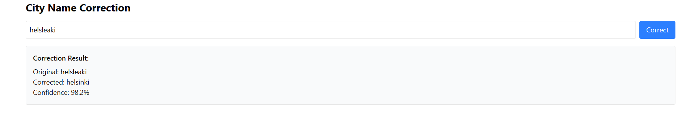

# FreightFixer

A web application for detecting and correcting misspelled shipping destination data. It uses machine learning to analyze shipment records, suggest corrections, and update data after user confirmation.

## Demo
The following is an example of the application in action. The user inputs a misspelled city name, and the application suggests corrections. The user can then confirm the correction, and the application will update the data (coming soon).


**Features:**

- **GUI**: Built with Vite, React, TypeScript, and shadcn/ui
- **Data Generation**: Synthetic dataset generator for training and testing
- **Address Validation**: Automated detection of typographical errors
- **Correction Suggestions**: ML-powered suggestions for address corrections
- **User Confirmation**: Web interface for reviewing and confirming changes

**Tech Stack:**

- **Frontend**:
  - Vite + React + TypeScript
  - shadcn/ui for beautiful, accessible components
  - Tailwind CSS for styling
  - React Router for navigation and routing
- **Backend**:
  - Flask for API server
  - PyTorch for ML model serving
  - CORS support for frontend-backend communication
- **Machine Learning**:
  - Sequence-to-sequence model for text correction
  - Character-level encoding for robust error handling
  - Pre-trained model for city name correction

## Running the Application

### Prerequisites

- Node.js (v18 or higher)
- npm (v8 or higher)
- Python 3.8+ (for backend and ML)
- CUDA-capable GPU (optional, for faster ML inference)

### Installation

1. Clone the repository:

```bash
git clone https://github.com/yourusername/FreightFixer.git
cd FreightFixer
```

2. Install frontend dependencies:

```bash
npm install
```

3. Install backend dependencies:

```bash
cd src/backend
pip install -r requirements.txt
```

### Development

1. Start the backend server:

```bash
cd src/backend
python app.py
```

2. In a separate terminal, start the frontend development server:

```bash
npm run dev
```

3. Open your browser to `http://localhost:5173` (or the port shown in your terminal)

### Data Generation

To generate synthetic shipment data:

```bash
python src/scripts/dataset_generator.py
```

This will create a CSV file with clean and noisy address data for training and testing.

## Project Structure

- `src/`: Source code
  - `main.tsx`: Application entry point with BrowserRouter setup
  - `App.tsx`: Main application component with route definitions
  - `pages/`: Application pages
    - `Dashboard.tsx`: Main interface with city correction feature
    - `Welcome.tsx`: Landing page
  - `components/`: React components
    - `ui/`: shadcn/ui components
  - `services/`: API service layer
    - `cityCorrection.ts`: ML model API client
  - `backend/`: Flask backend
    - `app.py`: API server and ML model serving
    - `requirements.txt`: Python dependencies
  - `ml/`: Machine learning models
    - `city_correction_model.pth`: Pre-trained model
    - `model_vocab.pkl`: Model vocabulary
  - `scripts/`: Python scripts
    - `dataset_generator.py`: Synthetic data generator

## ML Development

### Model Architecture

- **Sequence-to-Sequence Model**: LSTM-based encoder-decoder architecture
- **Character-level Processing**: Handles arbitrary input lengths
- **Vocabulary**: Custom character-level vocabulary for robust error handling

### Model Integration

The ML model is served via a Flask API endpoint that:
- Accepts city names as input
- Returns corrected versions with confidence scores
- Handles preprocessing and postprocessing of text

### Using the Model

1. Enter a potentially misspelled city name in the correction page
2. The model will process the input and suggest corrections
3. Review and confirm the suggested corrections

## Contributing

1. Fork the repository
2. Create a feature branch
3. Commit your changes
4. Push to the branch
5. Create a Pull Request


## Future Work
- Improve the model with realistic data, and solve potential overfitting/generalization issues.
- Add more features to the dashboard
- Add more tests
- Add more documentation

## License

ISC
